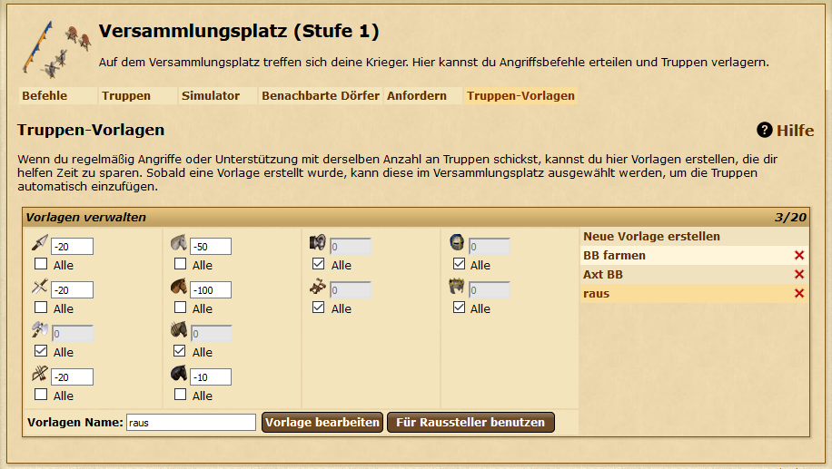

# DS-Raussteller

english version below

## Installation und Vorbereitung

User-Script in Tampermonkey o.ä. installieren. Auf Stämme-Seiten sollte in der oberen linken Ecke ein neuer Button erscheinen, welcher die Scriptoptionen öffnet. Unter Ziel sollten Koordinaten angegeben werden, welche aus den Benutzer-Dörfern angegriffen werden können (z.B. BB-Dorf oder ein eigenes, welches wahrscheinlich nicht von Gegnern angegriffen wird). Im Optimalfall sollte eine Truppen-Vorlage angelegt werden, in der definiert ist, welche Truppen rausgestellt werden sollen. Ein Beispiel:

## Wie funktioniert das Script?

Zum Starten des Scripts im Scriptmenü auf Start/Stop klicken, bis die "Lampe" grün wird. Es muss ein Browserfenster auf der Übersicht "Eintreffend" -> "Angriffe" geöffnet sein (optimalerweise genau ein Fenster oder Tab). Alle paar Minuten wird die Seite aktualisiert um neue Angriffe einzulesen. Das Script erstellt nun einen Plan, aus welchen Dörfern wann Truppen herausgestellt werden müssen. Ein paar Sekunden bevor ein Angriff auf ein eigenes Dorf eintrifft, öffnet das Script einen neuen Tab im Versammlungsplatz des angegriffenen Dorfes und stellt Truppen gemäß der eingestellten Truppen-Vorlage raus, indem es die angegebenen Koordinaten angreift. Sollte keine Truppenvorlage gesetzt sein, werden standardmäßig alle Truppen rausgestellt. Der Befehl mit den rausgestellten Truppen wird dann so abgebrochen, dass die Truppen nach dem letzten Angriff auf das Dorf wieder zurückkehren (es werden kurz aufeinander folgende Angriffe zusammengefasst!). Der so geöffnete Tab wird danach geschlossen.

Weiterhin sollte sichergestellt werden, dass es der Stämme-Seite erlaubt ist, Pop-Ups zu öffnen. (Entweder googlen oder sich einmal selbst angreifen, schauen ob sich ein neuer Tab öffnet, wenn nicht im Browser oben in der angezeigten Leiste auf "Erlauben" klicken)

## Adaption for International Versions

First download and install Tampermonkey (or similar) as extension for your Browser. Go to  and install the the `*.user.js` into Tampermonkey. To adapt the script for your Version of "Die Stämme" or "Tribalwars" you have to change a few lines of code:

In the first few lines you have to exchange "die-staemme.de" with the domain of your Version. E.g.:

`// @match       https://*.die-staemme.de/game.php?`

to 

`// @match       https://*.tribalwars.net/game.php?`

and all of the other following lines in the header of the script.

If you can't understand german and need an explanation on how the script works (or if you want to provide a translation..), feel free to contact me. 

